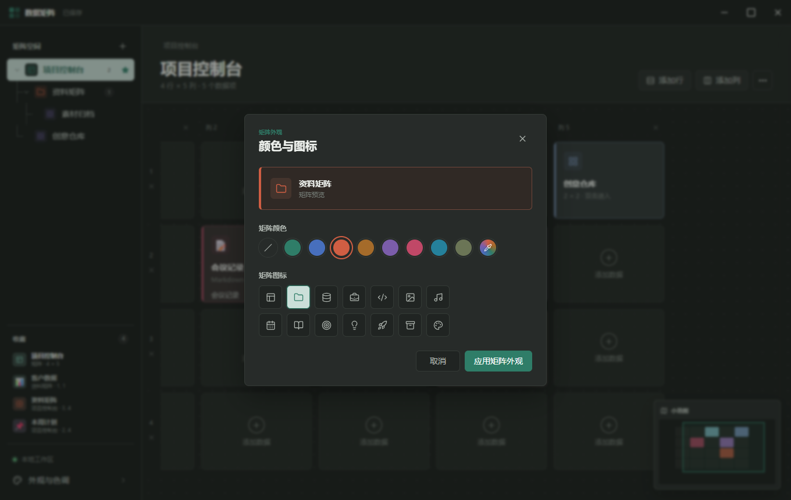

# 数据矩阵

[](https://github.com/AlanFEVM/DataMatrix/actions/workflows/build.yml)
[](LICENSE)

数据矩阵是一款基于 Electron 的二维效率工作区。它可以把文件、应用程序、网页、自定义数据、Markdown、结构化数据表和其他矩阵组织在同一张可扩展网格中。



## 主要能力

- 自由添加、删除行列，并使用中键拖动画布
- 拖入任意文件或应用程序，自动读取系统关联图标和图片缩略图
- 自动解析 Windows `.lnk` 和 `.url` 快捷方式图标，文件夹始终使用正确图标
- 嵌入网页并自动获取网页标题
- 支持文本、Markdown 和指定列类型的结构化数据表
- 矩阵可以嵌套矩阵，并支持从矩阵树拖入空单元格
- 右键交换数据格，带有重新排序动画
- 按住 `Ctrl` 右键拖拽项目到子矩阵卡片或左侧矩阵，目标已满时自动扩容
- 使用 `Ctrl+Z` 撤销矩阵编辑，`Ctrl+Y` 或 `Ctrl+Shift+Z` 重做
- 收藏数据格或完整矩阵，并从收藏栏快速打开
- 自定义矩阵和数据格的颜色、图标与表情
- 浅色、柔和、深色主题，以及类型色、级联色和单色模式
- 小地图同步显示数据格颜色，按 `M` 显示或隐藏
- 工作区自动保存到本机，不依赖云服务

## 安装

从 GitHub Releases 下载以下任一版本：

- `DataMatrix-Setup-*.exe`：Windows 安装程序
- `DataMatrix-Portable-*.zip`：推荐的快速便携版；解压一次后运行 `DataMatrix.exe`，后续启动速度最快
- `DataMatrix-Portable-*.exe`：单文件便携版；每次启动时会临时解压，适合优先考虑单文件携带的场景

当前发布包未进行商业代码签名，Windows SmartScreen 可能显示未知发布者提示。源码和构建流程均在本仓库公开。

## 本地开发

需要 Node.js 22 或更高版本。

```powershell
npm install
npm start
```

运行静态检查：

```powershell
npm run check
```

生成 Windows 安装版和便携版：

```powershell
npm run dist
```

产物会写入 `release/`。

## 数据与隐私

工作区数据保存在 Electron 的本机 `userData` 目录中。应用不会上传矩阵内容或本地文件；添加网页时只会请求目标网页以读取标题，双击网页链接时会交给系统浏览器打开。

## 项目结构

```text
main.js            Electron 主进程与系统能力
preload.js         安全的渲染进程桥接
renderer/          界面、交互与工作区状态逻辑
build/             打包图标等资源
scripts/           Windows 便携版打包脚本
```

## 贡献

问题反馈和 Pull Request 均可参考 [CONTRIBUTING.md](CONTRIBUTING.md)。

## 许可证

[MIT](LICENSE)
